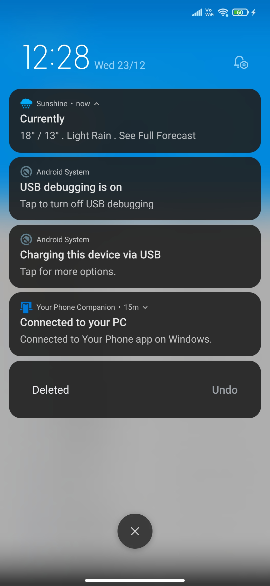
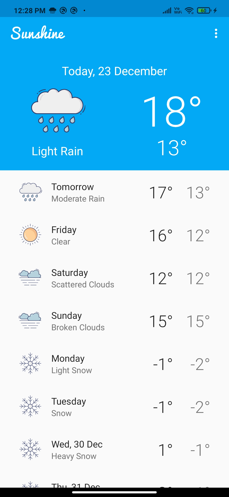
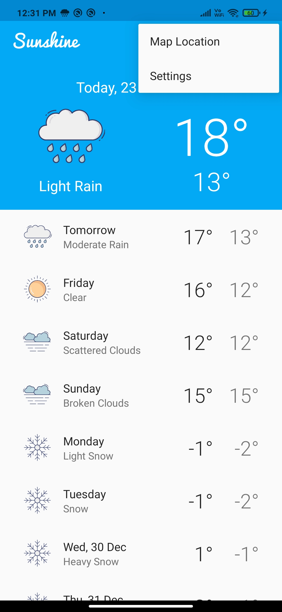
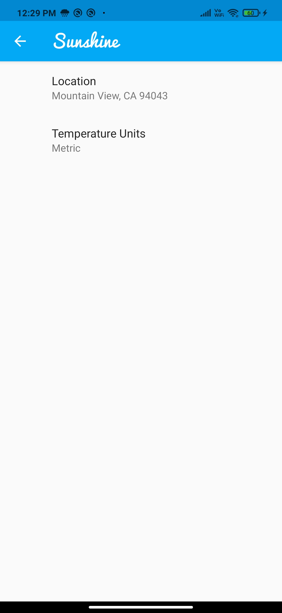
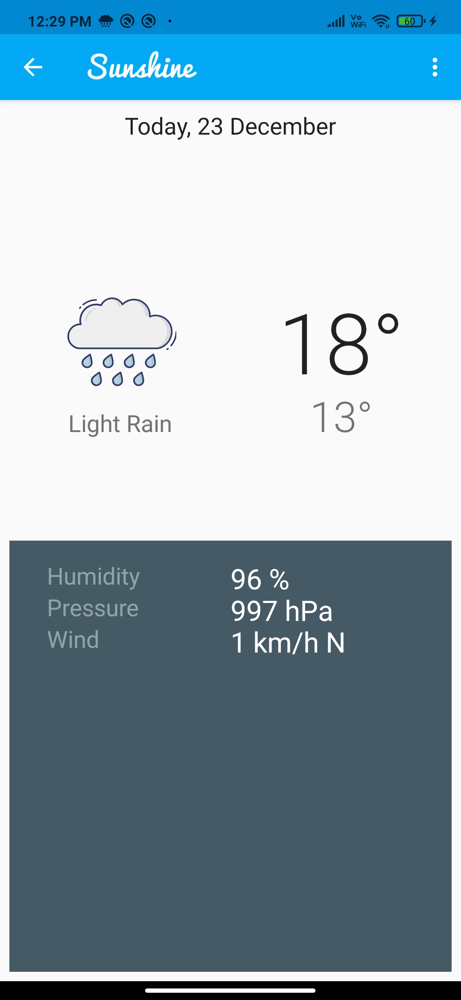

Sunshine
===================================

This app fetches weather data from udacity server.
Used in a Udacity course in the Developing Android Apps Nanodegree.

API used
=====

https://andfun-weather.udacity.com/weather

Icon pack used
=====

https://www.flaticon.com/authors/dinosoftlabs

## Screenshots

<table>
<tr>
<td></td>
<td></td>
</tr>
<tr>
<td></td>
<td></td>
</tr>
<tr>
<td></td>
</tr>
</table>
